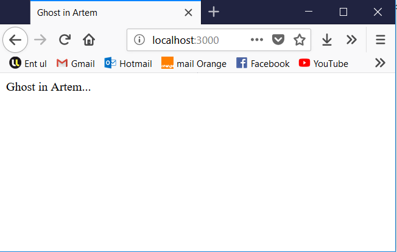

# Package Son

Ce répertoire contient toutes les sources et les instructions concernant l'instalation du package pour jouer les sons de Ghost In Artem.

## Dépendances
Toutes les dépendances de ce module sont dans le fichier:
> package.json

## Getting Started

Ces instructions vous permettront de connaître les dépendances et les commandes à effectuer pour lancer le code en local.

### Prérequis

Les choses dont vous avez besoin pour installer le projet:

```
- node (et npm)
- un navigateur web
- une connexion internet (pour télécharger les bibliothèques externes)
```

### Installation

Pour l'installation:

`
npm install
`

Si l'installation a fonctionnée, après déploiement vous aurez:



## Déploiement

Une fois l'installation terminée, une petite ligne de commande pour lancer le serveur:`npm start`. Dès que le serveur fonctionne, utilisez votre navigateur internet pour vous rendre à l'adresse

> localhost:3000

et vous aurez le résultat montré précédement. Pour jouer un son, utilisez l'adresse:

> localhost:3000/go_play/

Et toutes les instances connectées jouerons un son aléatoire. Si vous avez connecté le service d'authentication du module Ghost In Artem, le son sera joué en fonction de l'identifiant de la personne souhaité. Si le module bluetooth est connecté, le déclenchement du son sera automatique. 

## Auteur

* **Stanislas Barbillon** - *développeur du package* - [StanBarbeau](https://github.com/StanBarbeau)


